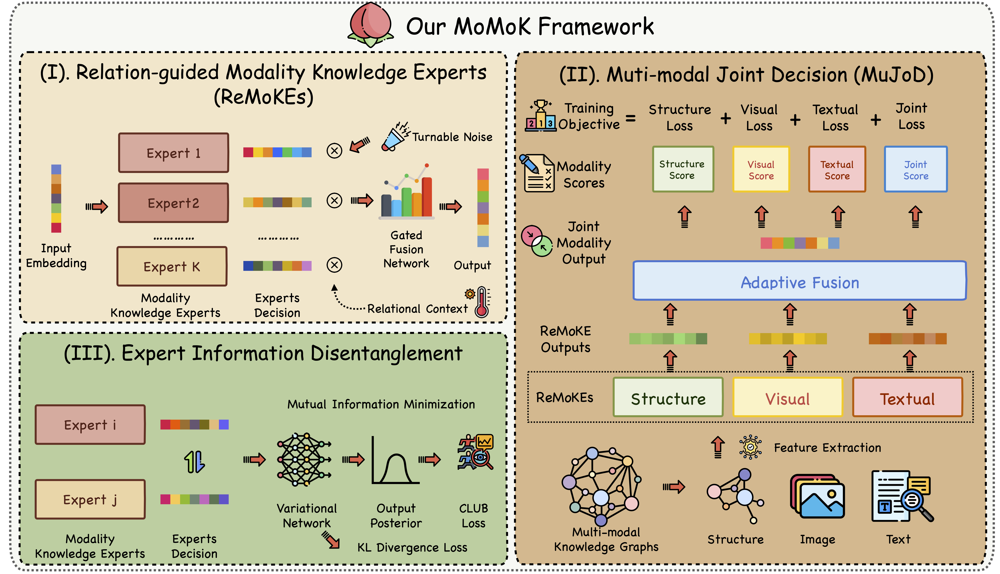

# Multiple Heads are Better than One: Mixture of Modality Knowledge Experts for Entity Representation Learning


> Learning high-quality multi-modal entity representations is an important goal of multi-modal knowledge graph (MMKG) representation learning, which can enhance reasoning tasks within the MMKGs, such as MMKG completion (MMKGC). The main challenge is to collaboratively model the structural information concealed in massive triples and the multi-modal features of the entities. Existing methods focus on crafting elegant entity-wise multi-modal fusion strategies, yet they overlook the utilization of multi-perspective features concealed within the modalities under diverse relational contexts. To address this issue, we introduce a novel framework with Mixture of Modality Knowledge experts (MOMOK for short) to learn adaptive multi-modal entity representations for better MMKGC. We design relation-guided modality knowledge experts to acquire relation-aware modality embeddings and integrate the predictions from multi-modalities to achieve joint decisions. Additionally, we disentangle the experts by minimizing their mutual information. Experiments on four public MMKG benchmarks demonstrate the outstanding performance of MOMOK under complex scenarios. 


## 🌈 Overview


## 🔬 Dependencies
- Python==3.9
- numpy==1.24.2
- scikit_learn==1.2.2
- torch==2.0.0
- tqdm==4.64.1
- Maybe other library version also works.

## 💻 Data preparation
The multi-model embedding of MMKGs are too large so you should download them from the [Google Drive Link](https://drive.google.com/file/d/1nRHdeWiVi9d_FKli3x7sO87ARasad39w/view?usp=sharing). Please unzip the embedding files and put them in the corresponding path in `datasets/`


## 📕 Train and Evaluation

You can refer to the training scripts in `scripts/train.sh` to reproduce our experiment results. Here is an example for DB15K dataset.

```bash
nohup python train.py --cuda 0 --lr 0.001 --mu 0.0001 --dim 200 --dataset MKG-W --epochs 2000 > log.txt &

nohup python train.py --cuda 1 --lr 0.0005 --mu 0.0001 --dim 300 --dataset MKG-Y --epochs 2000 > log.txt &
```
The evaluation results will be printed in the command line after training.

🤝 Cite:
```
@misc{zhang2024mixture,
      title={Mixture of Modality Knowledge Experts for Robust Multi-modal Knowledge Graph Completion}, 
      author={Yichi Zhang and Zhuo Chen and Lingbing Guo and Yajing Xu and Binbin Hu and Ziqi Liu and Wen Zhang and Huajun Chen},
      year={2024},
      eprint={2405.16869},
      archivePrefix={arXiv},
      primaryClass={cs.AI}
}
```

